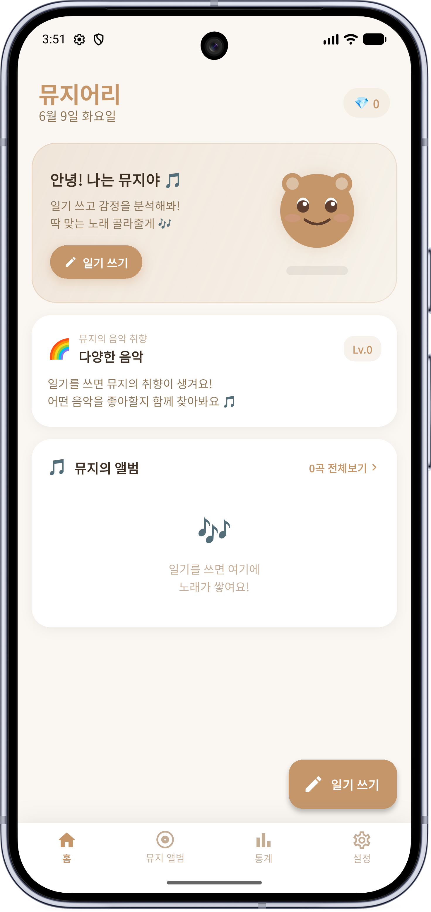
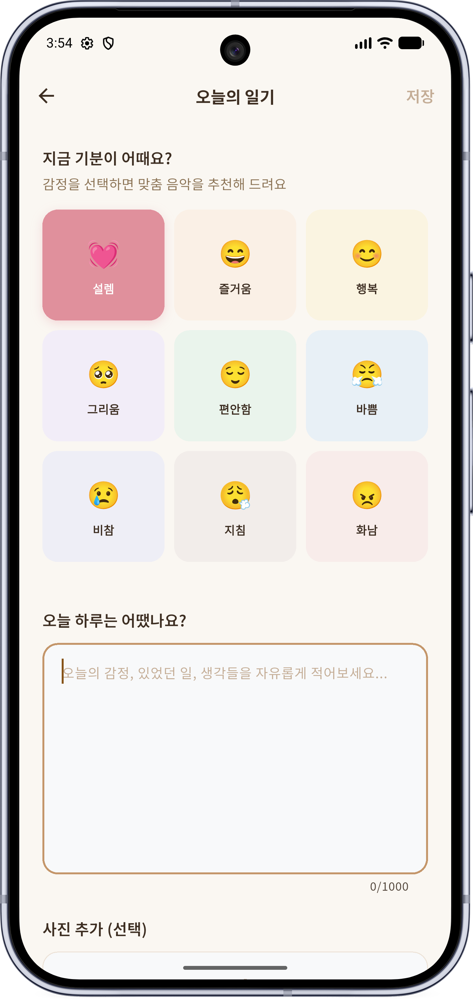
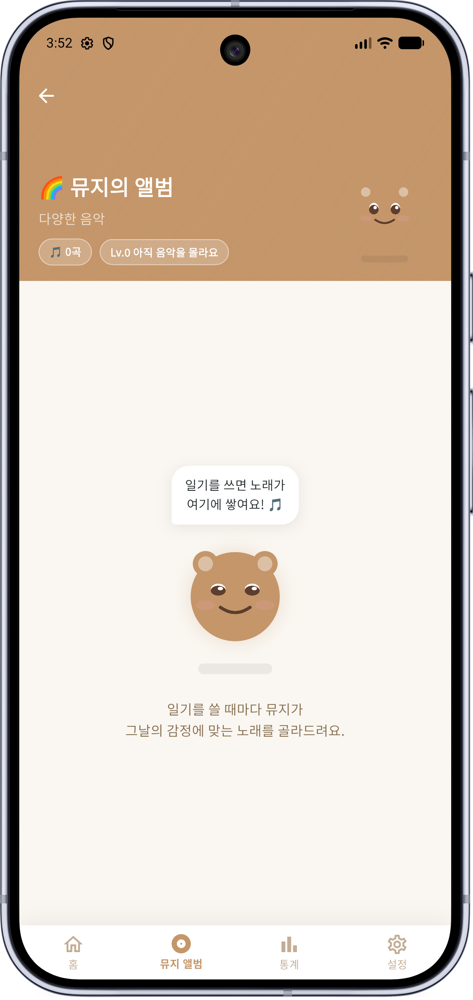
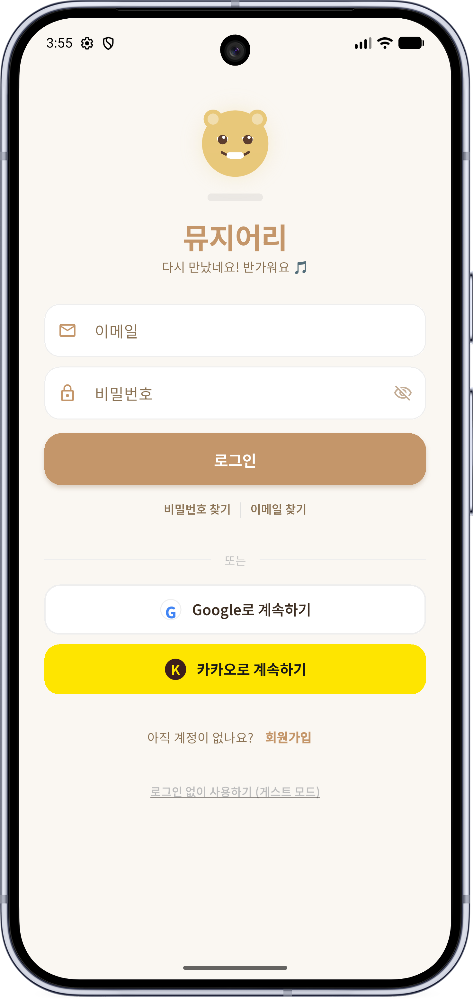
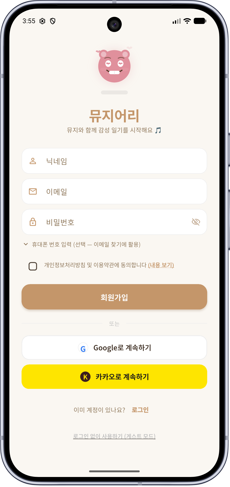
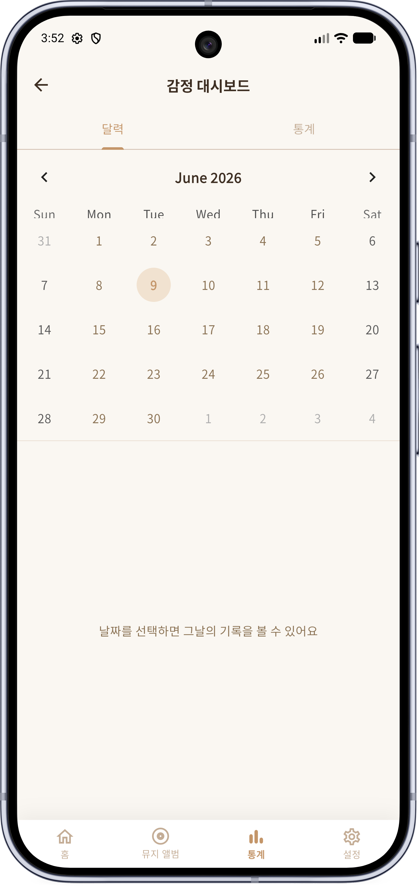
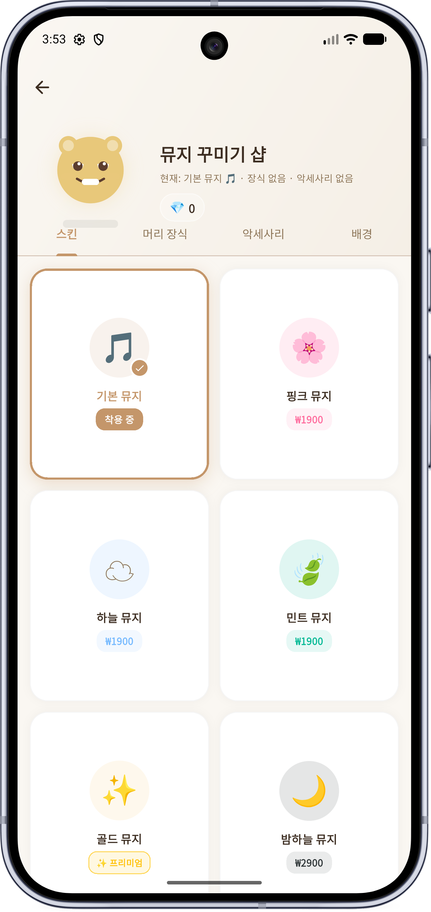
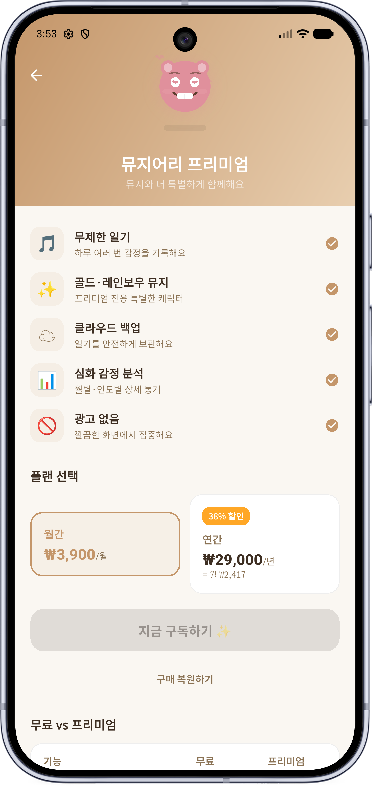
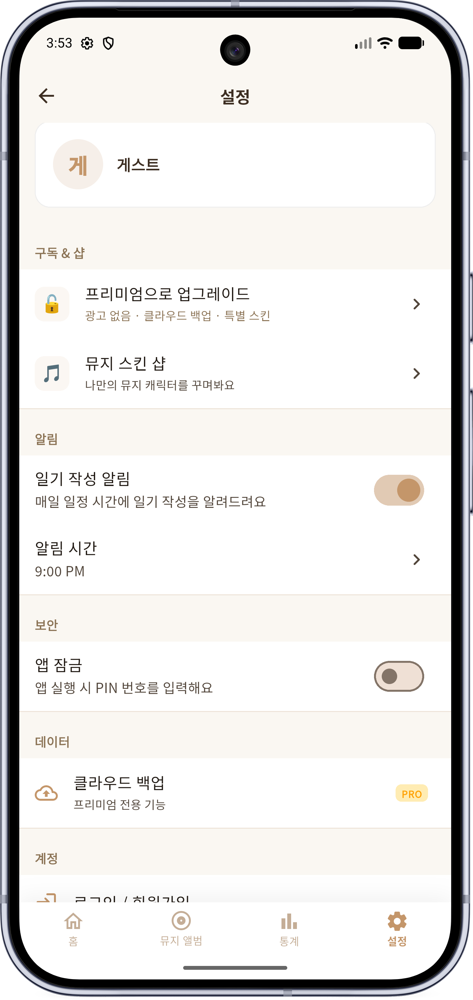

# 🎵 뮤지어리 (Musiary)

> **감정을 기록하고, 음악으로 위로받는 공간**  
> Flutter 기반 감정 일기 × 음악 추천 × 뮤지 성장 앱

<br>

[](https://flutter.dev)
[](https://firebase.google.com)
[](https://pub.dev/packages/sqflite)
[](https://developer.android.com)

**박다현 · 2023145030 · 프론트엔드프레임워크**

---

## 📱 실행 영상

https://github.com/ggpus111/musiary1.0/raw/main/Screen/실행영상(6.10.).mp4

> ▶ 위 링크 클릭 시 영상을 바로 볼 수 있어요

---

## 🖼️ 스크린샷

| 홈 | 일기 작성 | 앨범 |
|:--:|:--:|:--:|
|  |  |  |

| 로그인 | 회원가입 | 대시보드 |
|:--:|:--:|:--:|
|  |  |  |

| 샵 | 구독 | 설정 |
|:--:|:--:|:--:|
|  |  |  |

---

## 📊 발표자료

[📥 뮤지어리\_발표자료.pptx 다운로드](ppt/뮤지어리_발표자료.pptx)

---

## ✨ 주요 기능

### 📔 감정 일기
- 9가지 감정(설렘·즐거움·행복·그리움·편안함·바쁨·비참·지침·화남) 중 선택
- 자유 텍스트 일기 작성
- 키워드 기반 감정 분석으로 최종 감정 보정

### 🐾 뮤지 캐릭터
- 감정마다 다른 눈·입·눈썹 표현 (CustomPainter 순수 코드 렌더링)
- 감정별 파티클 이펙트: 하트·음표·눈물·Zzz·불꽃·반짝임
- 바운스 속도도 감정에 따라 다름

### 🎵 AI 음악 추천
- `youtube_explode_dart`로 YouTube API Key 없이 스트리밍
- 감정별 키워드 풀에서 랜덤 선택 → 매번 다른 곡 추천
- `just_audio`로 백그라운드 재생

### 🎶 뮤지의 앨범
- 일기 저장 시 대표곡 1개 자동 수집
- 감정별 필터링 / SQLite 로컬 DB 저장

### 💎 성장 & 보석 시스템
- 일기 작성 시 보석 +3 지급
- 6단계 레벨 시스템 (아기 뮤지 → 전설 뮤지)
- 보석으로 꾸미기 아이템 구매

### 🔐 로그인 & 인증
- 이메일/비밀번호 (이메일 인증 필수)
- Google 소셜 로그인
- 게스트 모드 (로컬 DB만 사용)

---

## 🛠️ 기술 스택

| 분류 | 기술 |
|------|------|
| **프레임워크** | Flutter (Dart) |
| **인증** | Firebase Auth (이메일 · Google) |
| **클라우드 DB** | Cloud Firestore |
| **로컬 DB** | SQLite (sqflite) |
| **음악** | youtube_explode_dart · just_audio |
| **상태관리** | Provider |
| **UI** | CustomPainter · Google Fonts |

---

## 🏗️ 아키텍처

```
UI Layer      → Screens + Widgets (Flutter)
      ↓
State Layer   → Provider (DiaryProvider, AuthProvider)
      ↓
Service Layer → LocalDbService · AuthService · YoutubeAudioService
      ↓
Data Layer    → Firebase Firestore + SQLite (로컬)
```

---

## ⚡ 코드 최적화 (9가지)

| 분류 | 적용 내용 | 효과 |
|------|----------|------|
| Provider | `muziProfile` 캐시 (`_cachedProfile`) | O(n) 루프 → O(1) |
| Provider | `loadEntries` 중복 호출 방어 | race condition 제거 |
| Provider | `SavedSong` 생성 3회 → 1회 | 불필요한 객체 제거 |
| Model | `SavedSong.copyWith()` 추가 | 불변 복사 패턴 |
| DB | `getEmotionStats` SQL GROUP BY | 전체 row 로드 없이 집계 |
| UI | `DateFormat` static 캐시 | 빌드마다 재생성 방지 |
| UI | `_DiaryEntryItem` StatelessWidget 분리 | 독립 rebuild |
| UI | `_MiniSongRow` StatelessWidget 분리 | 리스트 효율화 |
| UI | `MuziCharacter` RepaintBoundary 격리 | 애니메이션 repaint 전파 차단 |

---

## 🚀 실행 방법

```bash
# 1. 의존성 설치
flutter pub get

# 2. 에뮬레이터 또는 기기 연결 후 실행
flutter run
```

> **Firebase 설정**: `android/app/google-services.json`이 포함되어 있어 별도 설정 없이 실행 가능

---

## 📁 프로젝트 구조

```
lib/
├── main.dart
├── models/          # 데이터 모델
├── providers/       # 상태 관리
├── screens/         # 화면
├── services/        # 비즈니스 로직
├── utils/           # 테마 등 공통 유틸
└── widgets/         # 공통 위젯
```
